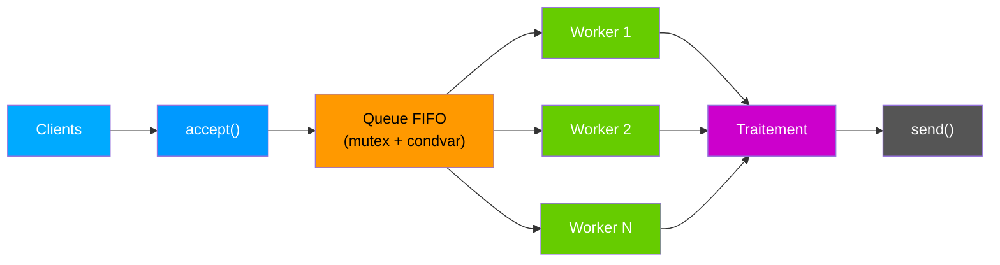
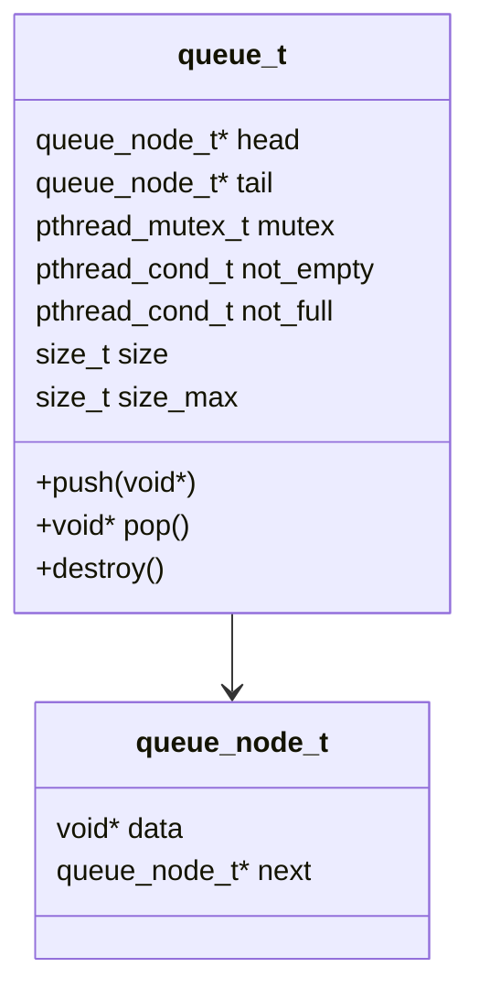
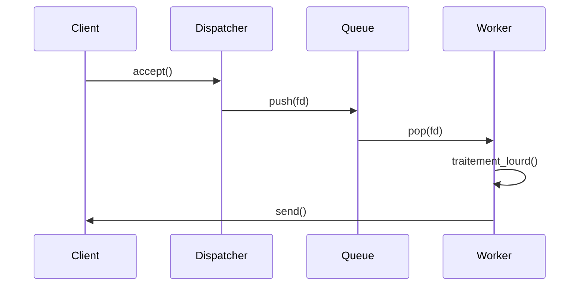
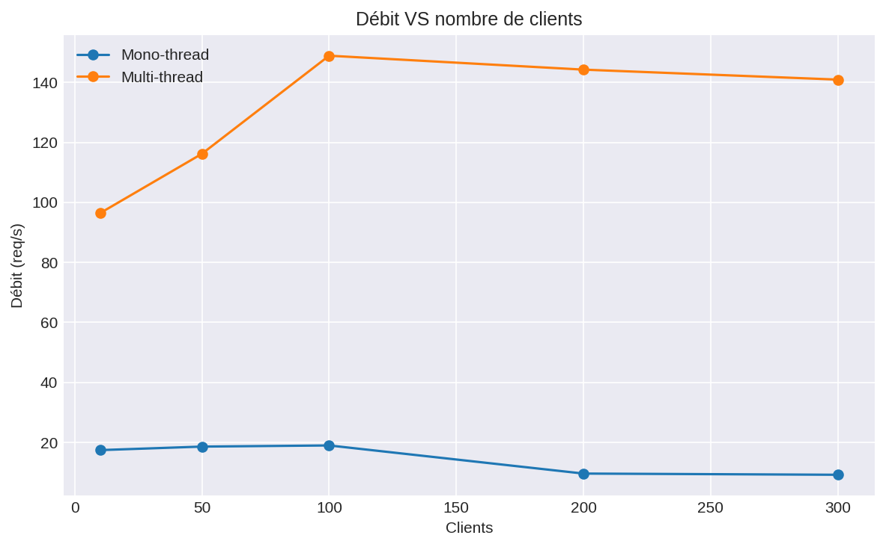
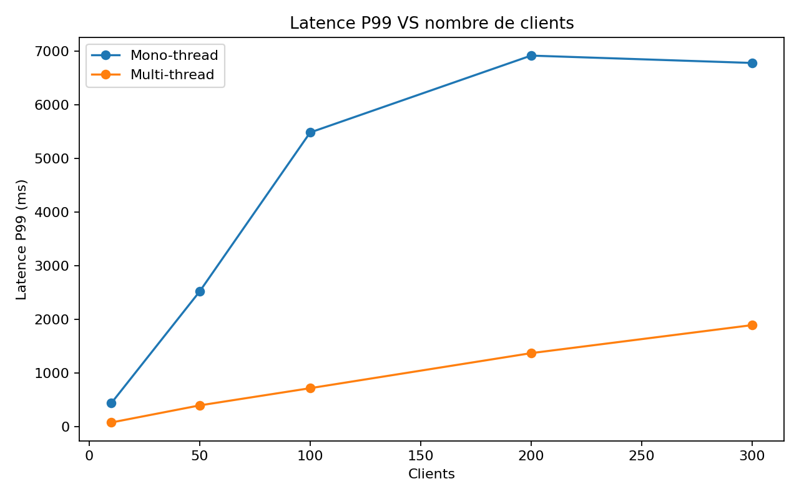
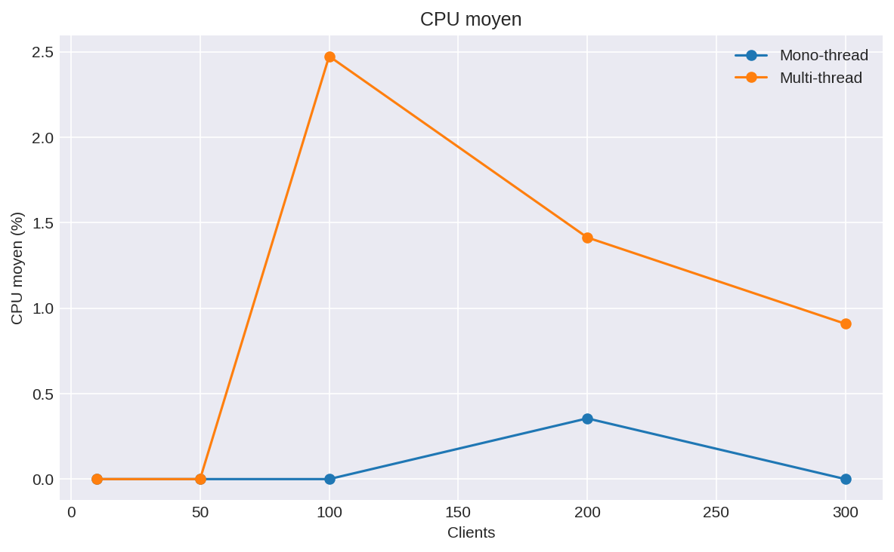

# 🚀 Serveur TCP & HTTP Hautes Performances — C/POSIX

## ⚡ Extreme Edition — Multi-threading • Queue FIFO • Benchmarks • UML • Mermaid • CI/CD

---

<p align="center">
  
  
  
  
  
</p>

---

# 🔧 Badges GitHub Actions CI/CD

| Workflow                                 | Badge                                                                                                                                         |
| ---------------------------------------- | --------------------------------------------------------------------------------------------------------------------------------------------- |
| **Build & Test (GCC + Make + Valgrind)** |        |
| **Static Analysis (Cppcheck)**           |  |
| **CodeQL Security Scan**                 |      |
| **Python Benchmarks CI**                 |  |

---

# 📚 Table des matières automatique

* [🎥 GIF Démonstrations](#-gif-démonstrations)
* [📦 Projet — Version FR/EN](#-projet--version-fren)
* [🧠 Diagrams Mermaid intégrés](#-diagrams-mermaid-intégrés)
* [📊 Benchmarks](#-benchmarks)
* [🛠 Installation](#-installation)
* [⚙ Exécution](#-exécution)
* [🧪 Tests & Validation](#-tests--validation)
* [📡 API HTTP](#-api-http)
* [📂 Architecture du projet](#-architecture-du-projet)
* [🚀 Pipeline DevOps complet](#-pipeline-devops-complet)
* [👤 Auteurs](#-auteurs)
* [📜 Licence](#-licence)

---

# 🎥 GIF Démonstrations


### Multi-thread server execution


### Benchmark execution


---

# 📦 **Projet — Version FR/EN**

## 🇫🇷 Version Française

Ce projet implémente **4 serveurs haute performance** basés sur :

* Sockets POSIX bas niveau
* Multi-threading (pthreads)
* Queue FIFO thread-safe
* HTTP parser minimaliste
* Benchmarks avancés Python
* Automatisation complète (Makefile, scripts, DevOps)

| Serveur            | Protocole | Architecture        |
| ------------------ | --------- | ------------------- |
| serveur_mono       | TCP       | mono-thread         |
| serveur_multi      | TCP       | multi-thread + FIFO |
| serveur_mono_http  | HTTP 1.1  | mono-thread         |
| serveur_multi_http | HTTP 1.1  | multi-thread + FIFO |

---

## 🇬🇧 English Summary

This project provides **4 high-performance network servers** using:

* POSIX low-level sockets
* Multi-threaded worker pool
* Thread-safe FIFO queue
* Minimal HTTP 1.1 router
* Python benchmark suite
* Full DevOps automation

---

# 🧠 Diagrams Mermaid intégrés

---

## 1) **Architecture Globale**



---

## 2) **Queue FIFO Thread-Safe**



---

## 3) **Modèle de Threads — Dispatcher & Workers**



---

# 📊 Benchmarks

Les figures sont auto-générées :






---

# 🛠 Installation

```bash
sudo apt install build-essential python3 python3-venv python3-pip
git clone https://github.com/WalidBenTouhami/server_project.git
cd server_project
make -j$(nproc)
```

---

# ⚙ Exécution

```bash
make run_mono
make run_multi
make run_mono_http
make run_multi_http
```

---

# 🧪 Tests & Validation

```bash
make test
valgrind --leak-check=full ./bin/serveur_multi
valgrind --tool=helgrind ./bin/serveur_multi
make debug
```

---

# 📡 API HTTP

| Route    | Description       |
| -------- | ----------------- |
| `/`      | Accueil           |
| `/hello` | JSON response     |
| `/time`  | Timestamp         |
| `/stats` | Worker statistics |

Exemple :

```json
{
  "msg": "Hello from HTTP server",
  "requests": 128,
  "worker": 3
}
```

---

# 📂 Architecture du projet

```
src/
├── http.c / http.h
├── queue.c / queue.h
├── serveur_mono.c
├── serveur_multi.c
├── serveur_mono_http.c
└── serveur_multi_http.c
```

---

# 🚀 Pipeline DevOps complet

Pipeline exécuté via :

```bash
./scripts/run_interactive.sh
```

Ce pipeline réalise :

* Vérification & génération HTTP
* Build C (optimisations O3 + LTO)
* Génération UML (PlantUML → SVG + injection README)
* Génération PPTX + PDF
* Démarrage automatique des serveurs
* Tests HTTP (curl)
* Stress-tests TCP/HTTP
* Benchmarks extrêmes JSON/CSV/PNG/HTML
* Monitoring CPU/mémoire
* Kill propre multi-threads
* Exécution CI/CD GitHub Actions

---

# 👤 Auteurs

| Auteur                 | Rôle                                | Expertise                |
| ---------------------- | ----------------------------------- | ------------------------ |
| **Walid Ben Touhami**  | DevOps, Multi-threading, Benchmarks | High-performance systems |
| **Yassin Ben Aoun**    | HTTP parser                         | Protocol engineering     |
| **Ghada Sakouhi**      | FIFO Queue, UML                     | Software architecture    |
| **Islem Ben Chaabene** | TCP mono-thread                     | POSIX networking         |

---

# 📜 Licence

```
MIT License — Academic Use Only
```

---


